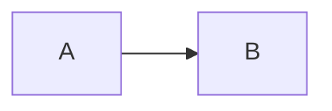
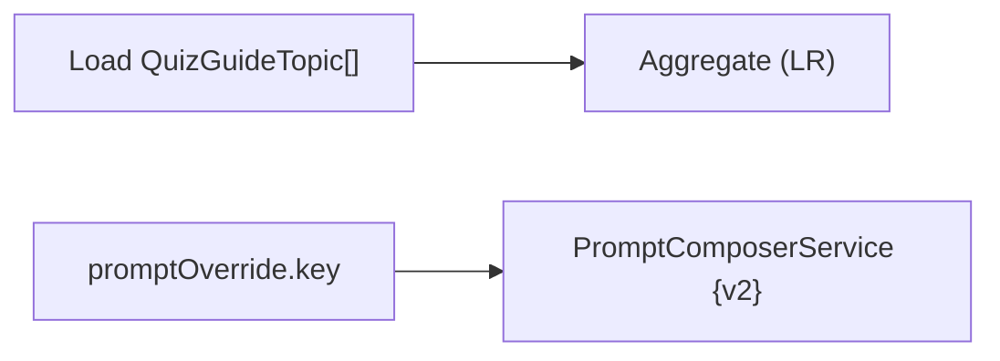

# Slidev Layout Rules

Use this reference when generating or regenerating `slides.md`.

## Repo Structure (addon-based)

```
docs/walkthroughs/
├── package.json              ← Slidev runtime + dev/build scripts, shared by all walkthroughs
├── node_modules/             ← shared, one install
├── _addon/                   ← Slidev local addon — playback engine, controls, captions, spotlight
│   ├── package.json (addon manifest)
│   ├── components/           ← GlobalCaptions / NarrationCue / TTSNavButtons
│   ├── composables/          ← useNarration / useTTSPlayback
│   ├── global-bottom.vue
│   └── style.css
├── <slug-1>/                 ← one walkthrough = one subdirectory
│   ├── README.md
│   └── slides.md             ← frontmatter must include addons: [./_addon]
└── <slug-2>/
    ├── README.md
    └── slides.md
```

**Adding a new walkthrough requires only two files** (`slides.md` + `README.md`) — no changes to `package.json`. The root uses a generic `npm run dev <slug>` dispatcher that auto-detects walkthroughs. Changes to playback logic only touch `_addon/` and automatically apply to all walkthroughs.

Every walkthrough's `slides.md` frontmatter must include:

```yaml
addons:
  - ./_addon
```

**Note the path**: `./_addon`, NOT `../_addon`. Slidev resolves addon paths relative to the npm script's cwd, which is `docs/walkthroughs/`. Writing `../_addon` causes an ENOENT error: `docs/_addon/package.json not found`.

Preview / build commands:

```bash
cd docs/walkthroughs
npm install                          # one-time
npm run list                         # list all available slugs
npm run dev <slug>                   # start dev preview, port 3030
npm run dev <slug> -- --port 4000    # pass extra flags to slidev after --
npm run build <slug>                 # output to <slug>/dist
```

Slidev merges `_addon/` components, composables, `global-bottom.vue`, and `style.css` into each deck. Every slide automatically gets GlobalCaptions, NarrationCue registration, spotlight CSS, and `useTTSPlayback`.

## Global Narration Architecture

The playback architecture is "**Slidev native nav controls + per-slide narration registration**". Slidev pre-mounts adjacent slides, so narration must be looked up by current slide number from a map — a stack is not safe:

```
Each slide in slides.md:
  <NarrationCue :text="`...narration with [h:anchor] markup...`" />
                    ↓ uses useSlideContext().$page for its own page number
                    ↓ register(page, text) / unregister(page)
composables/useNarration.ts:
  Map<page, text>; currentNarration = map[useNav().currentSlideNo]
composables/useTTSPlayback.ts (singleton state):
  speech / cue / spotlight engine; watches currentNarration → stop on change
_addon/components/TTSNavButtons.vue:
  Listen/Pause/Stop/CC/Voice — inserted into Slidev nav DOM via Vue <Teleport>,
  inline with native prev/next/overview/dark-mode buttons (.slidev-icon-btn class)
global-bottom.vue (Slidev convention file):
  <GlobalCaptions />  ← caption window only, bottom-center
```

Benefits:

- Controls appear inside Slidev's native nav, visually first-class
- Slide navigation automatically switches narration to the new slide (no bleed-over)
- Captions, buttons, and spotlight all share `useTTSPlayback` — state is always consistent
- One caption DOM node + one nav, spotlight DOM queries follow the current slide

`slides.md` must never contain `<TTSPlayer>` or `<GlobalTTSPlayer>`. Register narration with `<NarrationCue :text>` only. Controls are injected into Slidev's native nav DOM via `<Teleport>` in `TTSNavButtons.vue`. Note: Slidev does NOT auto-apply a user-defined `components/NavControls.vue` to override the built-in nav — Teleport is the only reliable integration path.

## Theme

Default theme is `@slidev/theme-seriph`: editorial / RFC feel, serif headings, restrained palette — well-suited to an engineer-to-architect briefing tone.

- `slides.md` frontmatter must include `theme: seriph`, plus `colorSchema: dark` or `colorSchema: light` as appropriate.
- Do not additionally specify `@slidev/theme-default` or override classes like `class: text-slate-100`; seriph handles them.
- Use `layout: cover` for the title slide, `layout: section` for section breaks, default or `layout: two-cols` / `layout: fact` for content pages. Avoid hand-crafting full-page CSS layouts.
- Custom CSS that is still needed (`.diagram-box`, `.phase-card`, `.compact-table`, etc.) belongs in `style.css`. For colors and fonts, use the theme's CSS variables rather than hardcoding hex values; use `var(--slidev-theme-primary)` and `currentColor`, with `opacity` when lightening is needed.
- When switching to a different theme, document the reason in the walkthrough README and add the dependency to `package.json`.

## Fit Is A Requirement

The walkthrough must be previewable inside Codex's in-app browser. Do not accept content that overflows the visible slide frame. This applies to Mermaid diagrams, screenshots, generated images, tables, phase cards, and TTS controls.

## Safe Slide Structure

- Keep each slide to one primary idea.
- Prefer 2-3 compact groups over one large diagram.
- Use `text-sm` only for secondary labels, not for dense unreadable bodies.
- Keep the top-right corner available for a compact audio control. Do not put headings, badges, or important labels in the top-right 12rem by 4rem area.
- Keep the bottom-center safe for YouTube-style captions. Avoid putting important content in the bottom 5rem of the slide when narration is expected.
- Avoid large vertical Mermaid diagrams. If a flow has more than five nodes, use phase cards or split into two slides.
- Avoid thin "railroad" diagrams that occupy only a narrow band and leave most of the slide empty. If a linear flow has more than four nodes, convert it into stage cards with responsibilities, data, and why it matters.

## Diagram Rules

- Wrap Mermaid diagrams in a bounded container:

```html
<div class="diagram-box">



</div>
```

- Use left-to-right (`LR`) diagrams by default for process diagrams.
- Do not use a long left-to-right flowchart as the only meaningful content on a slide. A diagram must either be compact and central, or be paired with explanatory cards/bullets that fill the slide with useful review context.
- Use top-down (`TD`) only for short diagrams with four or fewer rows.
- Use `sequenceDiagram` only when it has three or fewer message rows. Longer API handshakes should become compact tables or cards.
- Use `erDiagram` only for relationships between multiple entities. For one entity with many fields, use grouped cards or a compact table instead of rendering every field in Mermaid.
- Do not put long implementation phase labels directly inside Mermaid nodes. Put short labels in the diagram and explain details in nearby bullets or cards.
- For timelines and implementation plans, prefer cards over Mermaid when the text is the point.

## Mermaid Label Escaping (a real footgun)

Mermaid's node syntax `id[label]` / `id(label)` / `id{label}` treats the label as bare text. **If a label contains any `[]` / `{}` / `()` characters, it must be wrapped in double quotes** — otherwise the parser treats the inner brackets as the start of a new node definition and throws an error like:

```
Error: Parse error on line 2:
...[Load QuizGuideTopic[]]   load --> agg[A
-----------------------^
Expecting 'SQE', ..., got 'SQS'
```

❌ Wrong:
```mermaid
flowchart LR
  load[Load QuizGuideTopic[]]  --> agg[Aggregate (LR)]
  override[promptOverride.key]  --> composer[PromptComposerService {v2}]
```

✅ Correct (wrap labels containing special characters in `"…"`):


Recommendation: **wrap all Mermaid node labels in double quotes by default**. This is more robust than deciding case-by-case which characters need escaping, and also handles spaces, `.`, `:`, and other characters in labels.

`npm run validate <slug>` rule M1 catches this pattern. Run it before starting the dev server:

```bash
cd docs/walkthroughs
npm run validate <slug>     # structural lint including M1 Mermaid label escaping
```

Always run validate before `npm run dev <slug>`; validate clears the structural checks, then the live dev server confirms visual rendering.

## Data Model Slides

Data model slides must answer "what should the reviewer understand or decide?", not merely list fields.

- Start with a takeaway sentence that explains the model's job.
- Organize details by design promise, such as identity, authority, update path, or visibility.
- Include a review lens: what would be wrong if this model is wrong?
- Avoid four generic buckets of fields unless each bucket explains a decision or risk.
- If the model is one table, explain why one table is enough and what deliberately stays out of it.

## Spotlight Anchors

When a slide element will be targeted by `[h:id]` narration markup, the element must have `data-walkthrough-anchor="id"`. Naming conventions:

| Element type | Naming | Example |
|---|---|---|
| Card (phase / data / step) | `card-<role>` | `card-llm`, `card-prompt-authority` |
| Table row | `row-<key>` | `row-step2` (second row of the API handshake table) |
| Step grid card | `step-<phaseKey>` | `step-phase3b` |
| Bullet item | `bullet-<key>` | `bullet-payload-removed` |
| Inline phrase (text fragment) | `span-<key>` | `span-xor` (wrapping the three letters "xor") |

HTML usage:

```html
<div class="phase-card border-amber-400" data-walkthrough-anchor="card-llm">
  <div class="phase-future font-bold">LLM pipeline</div>
  <p>...</p>
</div>

<tr data-walkthrough-anchor="row-step2"> ... </tr>

<li data-walkthrough-anchor="bullet-payload-removed">...</li>

Text with an inline <span data-walkthrough-anchor="span-xor">**xor**</span> constraint.
```

Multiple anchors are space-separated (HTML token list convention): `data-walkthrough-anchor="card-llm card-pipeline"`.

Corresponding narration markup:

```
<NarrationCue :text="`Three boxes, left to right. [h:card-teacher]Teacher UI on the left[/h], ...`" />
```

Spotlight visuals are defined in `style.css`: `.walkthrough-spotlight` adds `ring + scale(1.025) + brightness`. Ring color comes from the `--spotlight-color` CSS variable, already preset for `amber` / `sky` / `slate` borders. If you add cards with other color schemes, add a matching `--spotlight-color` CSS rule.

## Anchor Range Semantics (implementation hard spec)

The `[h:id]...[/h]` range and caption cue range **must share the same coordinate space** for the half-open interval overlap check. **Do not use approximate ratio mapping.**

1. **Single coordinate space**: the `cleanText` produced by `parseMarkup` (markup stripped, whitespace NOT collapsed) is the shared coordinate space for anchor ranges and cues. **Never** apply `.replace(/\s+/g, ' ')` or any whitespace compression to this string before feeding it to TTS — that would put anchor ranges (in stripped coordinates) and cues (in collapsed coordinates) on different tracks, requiring ratio scaling as a workaround. Ratio scaling is an approximation; boundary anchors will be misclassified. Extra whitespace has no audible or visual impact on TTS or captions.

2. **Half-open intervals**: both `anchor.end` and `cue.endChar` are exclusive (the position **after** the last character). The overlap check must use:

   ```
   overlap = anchor.end > cue.startChar  AND  anchor.start < cue.endChar
   ```

   Equivalent short-circuit for no-overlap: `r.end <= startChar || r.start >= endChar`. **Do not** write `<` / `>` — that is a fence-post bug that would pull an anchor whose `start` exactly equals the previous cue's `end` into the wrong cue.

3. **Validation sample**: run this sample and confirm the spotlight sequence is `[a] → (none) → [b] → (none)`:

   ```
   narration:  [h:a]甲[/h]. 乙. [h:b]丙[/h]. 丁.
   expected cues:    甲. | 乙. | 丙. | 丁.
   expected anchors: [a] | []  | [b] | []
   ```

   If cue 1 ("乙.") or cue 3 ("丁.") carries any anchor, one of the two rules above is violated.

## Global CSS Lives In `style.css`

Slidev treats `<style>` blocks inside `slides.md` as per-slide scoped — they only apply to that slide. Cross-slide shared styles (grid, card, table layouts) **must** go in `style.css` in the walkthrough's root directory; Slidev loads it globally. Keep `<style>` blocks inside `slides.md` only for single-slide micro-adjustments.

Known footgun: putting `.phase-grid` and similar shared styles in a `<style>` block at the top of `slides.md` makes the title slide look correct, but all subsequent slides using `.phase-grid` fall back to `display: block` vertical stacking.

## Required CSS

Include or preserve equivalent CSS in `style.css` (not in `slides.md`):

```html
<style>
.slidev-layout {
  overflow: hidden;
}

.diagram-box {
  align-items: center;
  display: flex;
  justify-content: center;
  margin: 0.75rem auto;
  max-height: 330px;
  max-width: 100%;
  overflow: hidden;
}

.diagram-box .mermaid,
.diagram-box .mermaid svg {
  height: auto !important;
  max-height: 330px !important;
  max-width: 100% !important;
  width: 100% !important;
}

.phase-grid {
  display: grid;
  gap: 0.75rem;
  grid-template-columns: repeat(3, minmax(0, 1fr));
}

.phase-card {
  border: 1px solid #334155;
  border-radius: 8px;
  min-height: 132px;
  padding: 0.85rem;
}

.data-grid {
  display: grid;
  gap: 0.75rem;
  grid-template-columns: repeat(2, minmax(0, 1fr));
  margin-top: 1rem;
}

.data-card {
  border: 1px solid #334155;
  border-radius: 8px;
  min-height: 118px;
  padding: 0.85rem;
}

.data-card strong {
  color: #38bdf8;
  display: block;
  margin-bottom: 0.45rem;
}

.data-card p {
  font-size: 0.82rem;
  line-height: 1.35;
  margin: 0;
}

.takeaway {
  color: #94a3b8;
  font-size: 1.05rem;
  line-height: 1.45;
  margin-bottom: 1rem;
}

.compact-table {
  border-collapse: collapse;
  font-size: 0.82rem;
  line-height: 1.28;
  margin-top: 1rem;
  width: 100%;
}

.compact-table th,
.compact-table td {
  border-bottom: 1px solid #334155;
  padding: 0.55rem 0.65rem;
  text-align: left;
  vertical-align: top;
}

.compact-table th {
  color: #38bdf8;
  font-weight: 700;
}
</style>
```

## Preview Checks

After regeneration:

- Open the title slide.
- Open at least one Mermaid slide.
- Open the phase or implementation-plan slide.
- Confirm no visual crosses the slide frame.
- Confirm the TTS controls (Listen / Pause / Stop / CC / Voice) appear inside Slidev's bottom-left nav, inline with prev/next/overview, and do not cover meaningful slide content.
- Turn captions on and confirm captions appear bottom-center, do not cover primary slide content, and look like presentation subtitles rather than a debug text panel.
